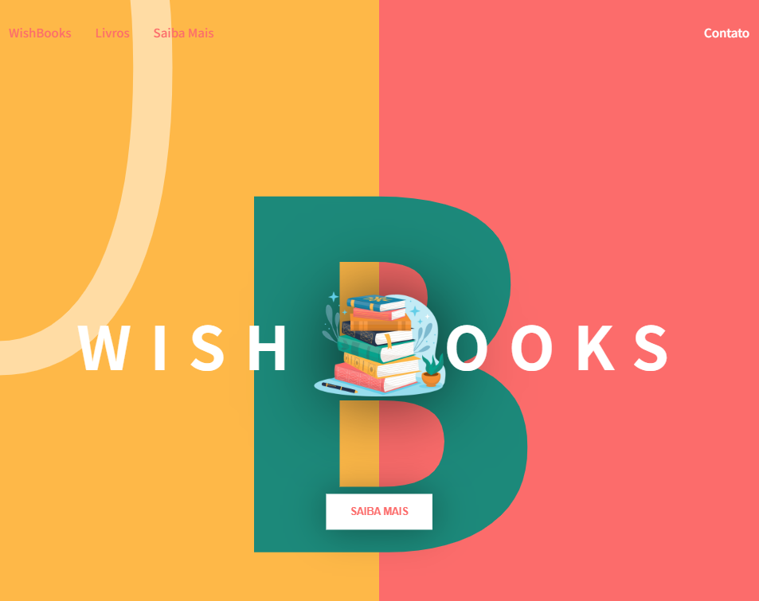

# WISH BOOKS 
Landing Page desenvolvida para a Matéria de Desenvolvimento Web do curso de Análise e Desenvolvimento de Sistemas da URI.

## :round_pushpin: Índice

* [1. Sobre o Projeto](#1-sobre-o-projeto)
* [2. Resumo do Projeto](#2-resumo-do-projeto)
* [3. Descrição do Projeto](#3-descrição-do-projeto)

## 1. Sobre o Projeto :computer:
Projeto desenvolvido para a disciplina de Desenvolvimento de Software que consiste no desenvolvimento de uma landing page utilizando as tecnologias HTML, CSS e JavaScript. 

## 2. Resumo do Projeto :page_facing_up:
### Wish Books: Sua Jornada Literária em Fantasia, Terror e Mitologia :fairy: :skull: :mermaid:
Bem-vindo à **Wish Books**, o seu destino online definitivo para uma seleção mágica e aterrorizante de livros. Aqui, você encontrará um universo onde a fantasia ganha vida, o terror assombra cada página e os seres mitológicos saltam das palavras para a sua imaginação. 

Não perca a chance de expandir seu universo literário. \
Visite a Wish Books e comece sua jornada através de mundos mágicos, histórias assustadoras e mitos fascinantes. Se você ama a magia, o mistério e a aventura, a Wish Books é o lugar ideal para suas próximas leituras.

## 3. Descrição do Projeto :open_file_folder:
### Tecnologias Utilizadas:
* HTML \
HTML semântico com a utilização de boas práticas em acessibilidade; 
* CSS \
Utilização de variáveis; \
Utilização de grid na section; \
Media queries para a responsividade em disposivos móveis como tablet e smartphones; 
* Javascript: \
Animações via js; \
Validação dos campos do formulário com regex e quantidade mínima de caracteres; \
Mensagem de erro quando o input não está preenchido corretamente; \
Modal com form de contato.

* Acessibilidade para leitores de tela, links âncora e teclas de atalho para facilitar a navegação via tab/teclado;
Teste realizado com NVDA 2024.3.

